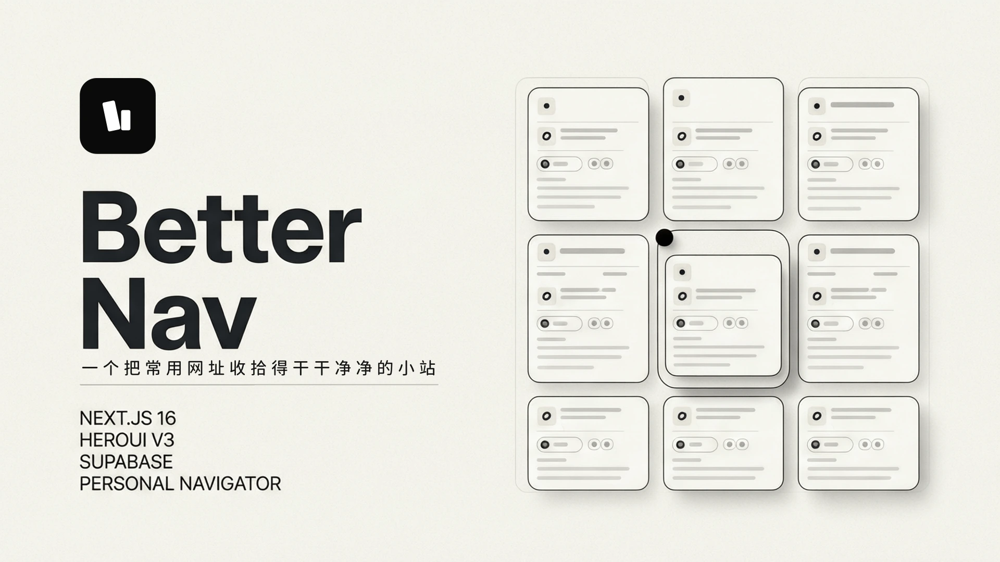

<div align="center">
  
  <h1>Better Nav</h1>
  <p>一个把常用网址收拾得干干净净的小站。</p>
</div>

<div align="center">
  <a href="https://dream.baiwumm.com/" target="_blank">
    
  </a>
  <a href="https://nextjs.org/" target="_blank">
    
  </a>
  <a href="https://www.heroui.com/" target="_blank">
    
  </a>
  <a href="https://supabase.com/" target="_blank">
    
  </a>
  <a href="./LICENSE" target="_blank">
    
  </a>
</div>

<div align="center">
  
</div>

## 🌱 简介

`Better Nav` 是一个基于 Next.js 与 Supabase 的个人导航站。

它专注做一件小事：把常用网址放在一起，打开就能用。支持亮暗主题、响应式布局、基础 SEO，以及登录后的网站分类与管理。

## 🌿 截图

| 亮色模式 | 暗色模式 |
| --- | --- |
|  |  |

| 分类管理 | 站点列表 |
| --- | --- |
|  |  |

## ☘️ 技术栈

- Next.js 16 + React 19
- HeroUI v3
- Tailwind CSS v4
- Supabase
- Vercel

## 🪴 本地开发

### 🌱 环境要求

- Node.js >= 20.9（Next.js 16 要求）
- pnpm

### 🌵 启动项目

```bash
git clone https://github.com/baiwumm/better-nav.git
cd better-nav
pnpm install
pnpm dev
```

先将 `.env.example` 复制为 `.env.local`，再补全你自己的环境变量。

默认访问：`http://localhost:3000`

## 🌼 环境变量

项目主要使用这些环境变量：

```bash
NEXT_PUBLIC_SUPABASE_URL=
NEXT_PUBLIC_SUPABASE_ANON_KEY=
NEXT_PUBLIC_SUPABASE_STORAGE_BUCKET=logos

# 后台管理员邮箱白名单，逗号分隔多个。不进这个列表的账号登不上后台
ADMIN_EMAILS=

NEXT_PUBLIC_APP_NAME=Better Nav
NEXT_PUBLIC_APP_TITLE=一个把常用网址收拾得干干净净的小站
NEXT_PUBLIC_APP_DESC=把常用网址放在一起，打开就能用。
NEXT_PUBLIC_APP_KEYWORDS=Better Nav,常用网站,网站入口,工具入口
NEXT_PUBLIC_APP_URL=http://localhost:3000

NEXT_PUBLIC_AUTHOR_NAME=
NEXT_PUBLIC_AUTHOR_ROLE=

# 备案信息与统计（可选，留空则不渲染对应区块）
NEXT_PUBLIC_ICP=
NEXT_PUBLIC_GUAN_ICP=
NEXT_PUBLIC_GOOGLE_ID=
NEXT_PUBLIC_CLARITY_ID=
```

完整示例见 [`.env.example`](./.env.example)。

## 🍀 Supabase 配置

### 1. 创建项目

新建一个 Supabase 项目，拿到 `NEXT_PUBLIC_SUPABASE_URL` 与 `NEXT_PUBLIC_SUPABASE_ANON_KEY`。

### 2. 初始化数据结构

项目自带初始化脚本 [`supabase/schema.sql`](./supabase/schema.sql)，一次执行就能建好全部依赖：

- 表 `ds_categorys`、`ds_websites`（含名称唯一约束与外键）
- `updated_at` 触发器
- 访问计数函数 `increment_visit_count`
- 行级安全（RLS）：匿名只读，仅管理员可写
- `logos` 存储桶及桶级读写策略

执行方式，推荐第一种：

1. Dashboard → SQL Editor 粘贴全文，**先把脚本内第 1 段 `is_admin()` 里的邮箱换成你自己的**，再点 Run
2. 或本地 `psql "$DATABASE_URL" -f supabase/schema.sql`

> ⚠️ 脚本面向全新项目。已有线上库不要整段跑：第 5 段会 DROP 并重建两张表上的全部 RLS 策略，第 1 段的 `create or replace function is_admin()` 也会把手工维护的白名单换成占位邮箱，跑完后台增删改会全部返回 401。
>
> 建议在 Dashboard 里改邮箱，不要改仓库里的文件，避免把真实邮箱提交进 git。

邮箱需要在两处保持一致，第 4 步会一起讲到。

### 3. 配置登录方式

后台白名单按邮箱判定，所以至少要启用一种登录方式：

- Dashboard → Authentication → Providers → 开启 **Email**（需要 OAuth 的话再开 GitHub / Google）
- 建议关掉公开注册：Authentication → Providers → Email，取消勾选 *Allow new users to sign up*。登录页本身已移除注册入口，这一步是彻底堵掉注册接口

### 4. 创建管理员账号

登录页没有注册入口，第一个账号要在控制台建：

Dashboard → Authentication → **Users** → **Add user**，填邮箱和密码。

这里的邮箱必须与两处白名单完全一致（大小写不敏感，但建议统一小写）：

| 位置 | 作用 |
| --- | --- |
| `supabase/schema.sql` 的 `is_admin()` | 数据库层 RLS 兜底，决定能不能写库 |
| `.env.local` 的 `ADMIN_EMAILS` | 应用层接口与页面鉴权，决定能不能进 `/admin` |

### 5. 灌演示数据（可选）

想让首页一开始就有内容，再执行一次 [`supabase/seed.sql`](./supabase/seed.sql)。它同样幂等，文件末尾附了清理语句。

### 6. 验证跑通

```bash
cp .env.example .env.local   # 填入 URL、ANON_KEY、ADMIN_EMAILS
pnpm install && pnpm dev
```

按顺序确认：

1. 打开 `http://localhost:3000`，首页能看到分类和站点（灌过 seed 就有 4 个分类）
2. 用第 4 步的账号登录，能跳转到 `/admin`
3. 后台新增一个分类、上传 Logo 新建一个站点，两步都不报错
4. 回首页点一下站点卡片，回后台看该站点的访问计数变成 1

### 常见问题

| 现象 | 原因与解法 |
| --- | --- |
| 报 `Could not find the table 'public.ds_websites' in the schema cache` | PostgREST 缓存没刷新。再执行一次 `notify pgrst, 'reload schema';`，或到 Dashboard 的 API 文档页等它自动重载 |
| 登录后进 `/admin` 被弹回登录页 | `.env.local` 的 `ADMIN_EMAILS` 与账号邮箱不一致，或改了 `.env` 没重启 dev server |
| 能进后台但保存报 401 / 列表全空 | `schema.sql` 里 `is_admin()` 的邮箱还是占位符，数据库层把写操作挡了 |
| 上传 Logo 报 `new row violates row-level security policy`（storage.objects） | 第 6 段桶策略没执行完，或 `NEXT_PUBLIC_SUPABASE_STORAGE_BUCKET` 与桶名 `logos` 不一致 |
| 点卡片访问计数一直不涨 | `increment_visit_count` 不是 `security definer`，被 RLS 挡了。重跑 `schema.sql` 第 4 段 |

三层白名单鉴权的完整改动点，记录在 [`supabase/登录鉴权移植指南.md`](./supabase/登录鉴权移植指南.md)。


## 🌲 部署

推荐直接部署到 Vercel：

1. Fork 本项目
2. 在 Vercel 中导入仓库
3. 配置环境变量
4. 点击 Deploy

## 🌸 许可证

[MIT](./LICENSE) © [baiwumm](https://baiwumm.com)
